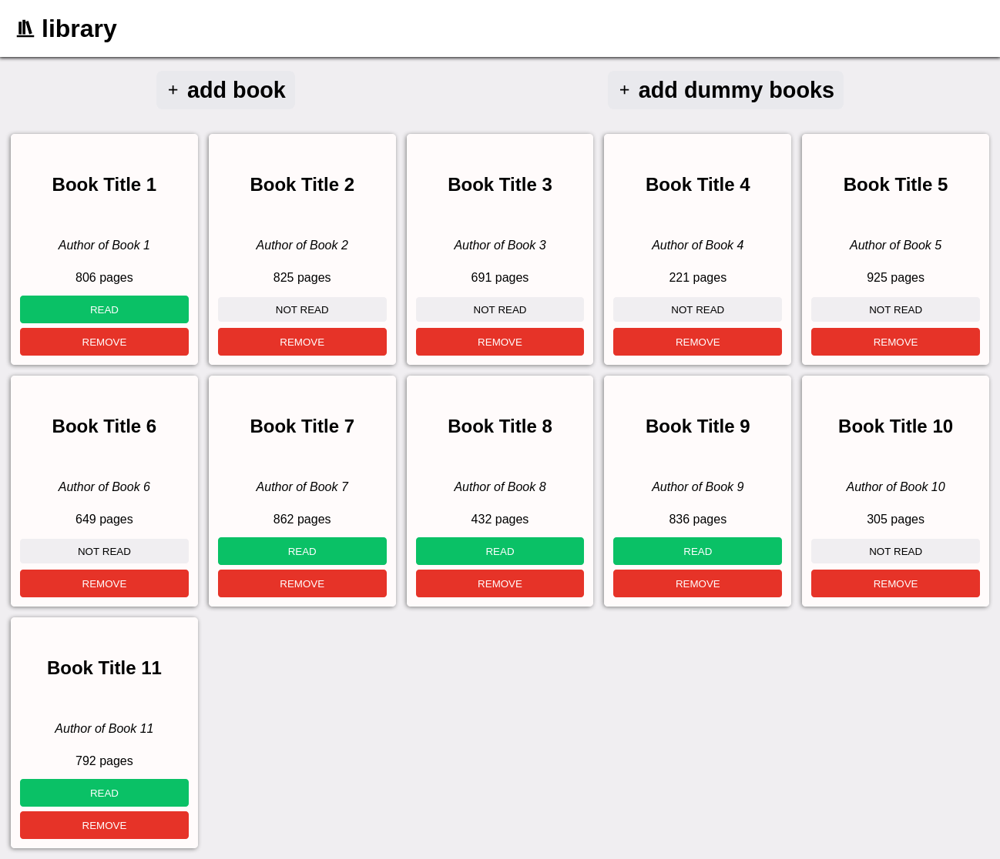

# Library Project

A simple user interface for viewing and managing books on a virtual shelf.

[Link to Project Description on The Odin Project](https://www.theodinproject.com/lessons/node-path-javascript-library)

## Live Preview

[Live Preview](https://tonyfred-code.github.io/project-library/)

## Description

The "Library" project is part of The Odin Project Full Stack Development Course. It allows users to manage a collection of books on a virtual shelf. Key features include:

- Adding books using a dialog with a form.
- Removing books.
- Marking books as read or not read.
- Adding dummy content for testing.

The project's layout was created using a combination of grid and flexbox, although it's not very responsive at the moment.

## Technologies Used

- HTML and CSS for building the user interface.
- Material Design Icons for the project's icons.
- JavaScript for code logic

## UI Inspiration

The project's user interface design was inspired by [michalosman's library project](https://github.com/michalosman/library). You can check out the true UI [here](https://michalosman.github.io/library/).

## License

This project is licensed under the [MIT License](LICENSE).

## Acknowledgments

Mention any other resources, libraries, or tutorials you used during the project.
